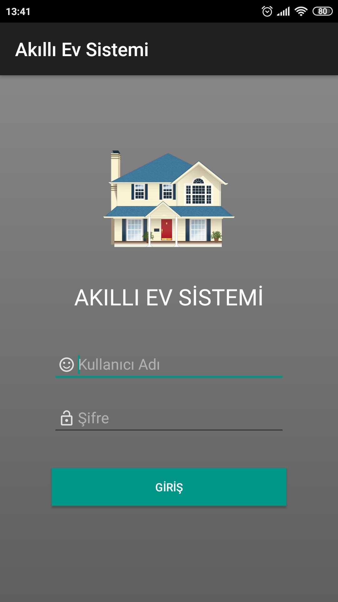
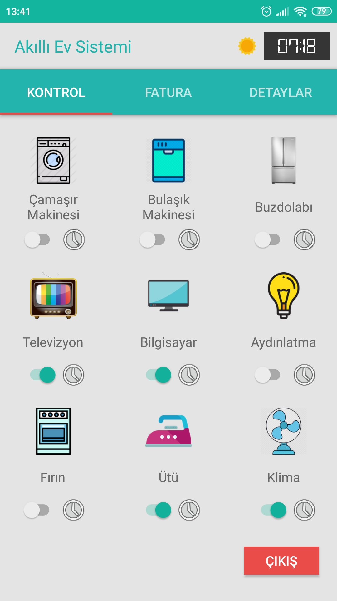
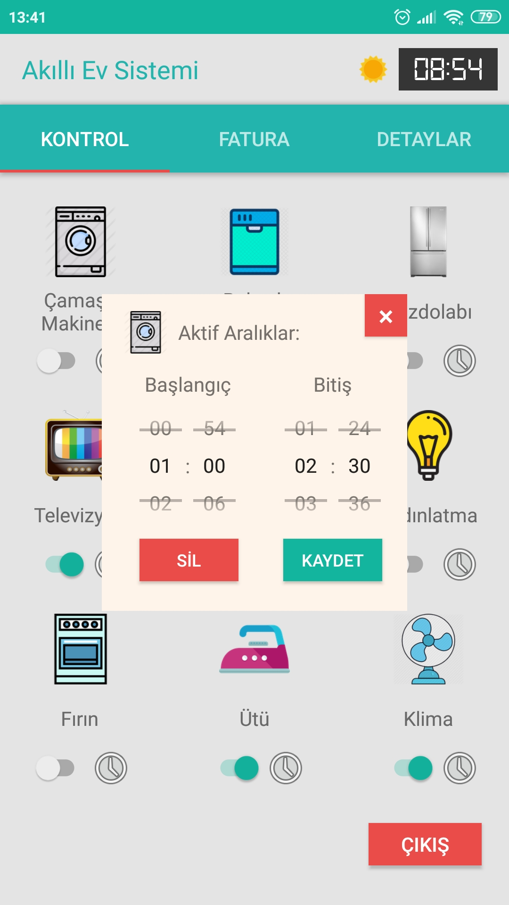
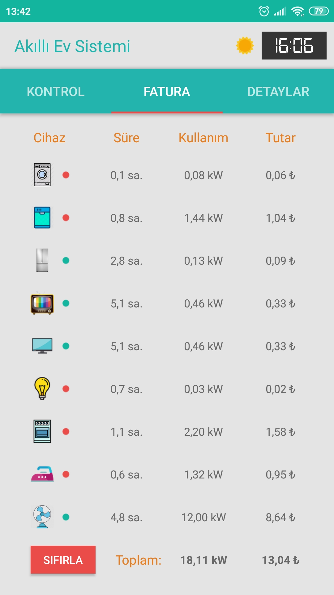
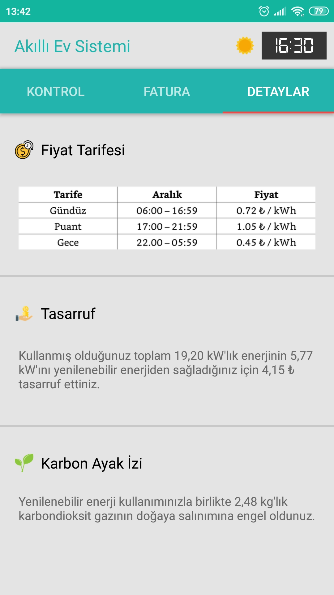

# Smart Home System

Smart Home System is an Android app that allows you to control your home. Google's Firebase framework used as database system.

## Screenshots

### Login Page

Users can login to system with their user names and passwords in the login page.

### Control Page

Users can activate/deactivate their devices in the control page.

### Timer Page

Users can set activated time intervals for their devices in the timer page.

### Bill Page

Users can display their usage details and payments for their devices in the bill page.

### Details Page

Users can display how much energy consumed from renewable energy sources and how much they save up from these sources in the details page. 

## Installation

Download and install **Akıllı Ev Sistemi.apk** onto your Android smartphone to try the application. You can use **u1** for user name and **p1** for password. Note that the system connected to a temporary Firebase database. If you want to use the app with full functionality, generate your own Firebase database and connect it to the Android project: https://firebase.google.com/docs/android/setup (You can figure out what should be database variables from the code.)

## Connection to a Real Hardware

If you want to connect the application to a real hardware, you can use Arduino. In Arduino, use the same firebase to provide interconnection between the hardware and the software.
